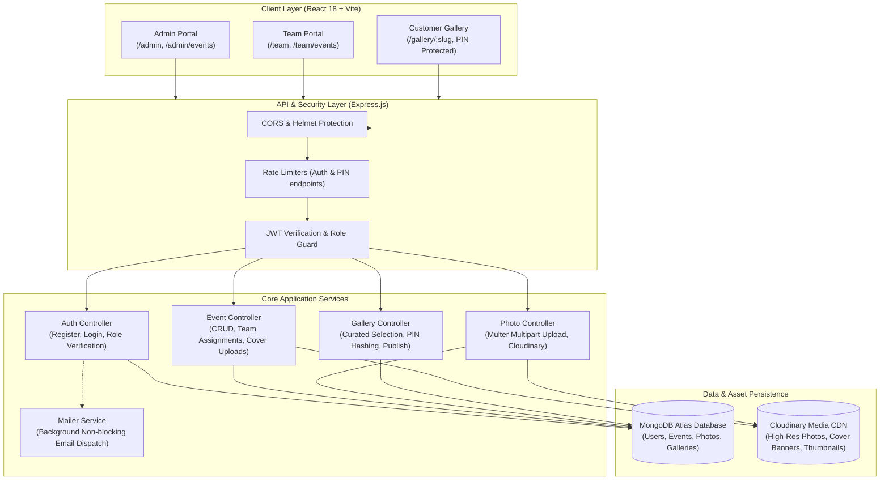
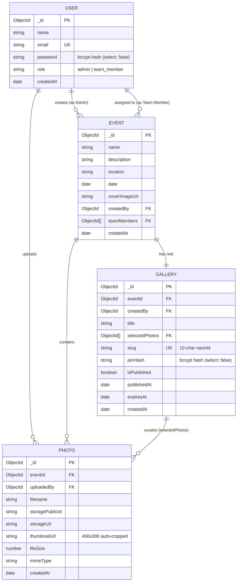

# SnapGallery — Collaborative Event Photography & Client Proofing Platform

[](https://opensource.org/licenses/MIT)
[](https://nodejs.org/)
[](https://react.dev/)
[](https://www.mongodb.com/)
[](https://cloudinary.com/)

> A full-stack, production-ready photo management and client proofing platform designed for photography studios and event production teams. Built with Node.js, Express, React, Vite, MongoDB, and Cloudinary.

---

## 📌 Submission Overview

| Resource | Link / Information |
|---|---|
| **Live Application URL** | *[Insert your live deployed frontend URL here]* |
| **Backend API URL** | [https://snapgallery-4jqc.onrender.com](https://snapgallery-4jqc.onrender.com) |
| **Source Code Repository** | [https://github.com/Pranaypatil43/snapgallery](https://github.com/Pranaypatil43/snapgallery) |
| **Demo Admin Email** | `admin@demo.com` *(or your configured admin email)* |
| **Demo Admin Password** | `demo1234` |
| **Demo Team Member Email** | `member@demo.com` *(or your configured team email)* |
| **Demo Team Member Password** | `demo1234` |
| **Demo Gallery URL** | *[Insert your live demo gallery URL here, e.g. https://your-domain.com/gallery/demo-event]* |
| **Demo Gallery PIN** | `482917` |

---

## 🌟 Project Overview

**SnapGallery** solves the workflow fragmentation experienced by photography studios and event coverage teams. Traditional methods (e.g., sharing massive Google Drive folders or wetransfer links) lack professional branding, role delegation, photo curation, and secure client delivery.

SnapGallery provides an end-to-end, multi-tier platform:
1. **Studio Lead (Admin):** Creates events with high-resolution cover banners, assigns photographers, curates selected shots, sets a secure 6-digit PIN, and publishes client-facing galleries.
2. **Field Photographer (Team Member):** Accesses assigned events, uploads bulk photo batches, and tracks upload metrics with direct Cloudinary transformation.
3. **Clients & Guests (Customers):** Access proofing galleries through a clean shareable URL and PIN verification — **no account or login required**.

---

## 🛠️ Technology Stack

| Layer | Technology | Purpose |
|---|---|---|
| **Frontend UI** | **React 18** (Vite 5) | Responsive, high-performance Single Page Application (SPA) |
| **Routing** | **React Router 6** | Client-side routing with role-based `ProtectedRoute` guards |
| **Styling** | **Modern Vanilla CSS & Design Tokens** | Glassmorphism, tailored HSL themes, micro-interactions, dark/light modes |
| **State & HTTP** | **React Context API + Axios** | Centralized authentication context and configured HTTP client with interceptors |
| **Backend Runtime** | **Node.js 18+** & **Express 4** | Scalable REST API with modular routing and asynchronous controllers |
| **Database** | **MongoDB** & **Mongoose 8** | Schematized document database with indexing, relationships, and population |
| **Object Storage** | **Cloudinary CDN** | Cloud asset storage, on-the-fly thumbnail generation, and image optimization |
| **Authentication** | **JWT (JSON Web Tokens)** + **bcryptjs** | Stateless token auth with role validation and salted password hashing (12 rounds) |
| **OAuth (Optional)** | **Passport.js** + **Google OAuth 2.0** | One-click Google sign-in for admin studio owners |
| **Security** | **Helmet**, **express-rate-limit**, **CORS** | HTTP security headers, rate limiting on sensitive routes, and origin sanitization |
| **Testing** | **Jest**, **Supertest**, **mongodb-memory-server** | Automated unit & integration tests with zero external database dependencies |
| **Deployment** | **Render** (API) · **Vercel / Render** (Frontend) | Production cloud hosting with continuous deployment |

---

## 📐 System Architecture

### Architecture Diagram



---

## 🗄️ Database Design

The database consists of 4 primary collections linked via MongoDB ObjectIds:



### Key Schema Design Decisions
- **`select: false` on Sensitive Fields:** `password` in `User` and `pinHash` in `Gallery` are excluded from query results by default, preventing accidental data leakage in JSON responses.
- **Index Optimization:** Indexes on `User.email`, `Event.createdBy`, `Event.teamMembers`, `Photo.eventId`, and `Gallery.slug` ensure sub-millisecond query performance.
- **Optimized Cover & Photo Pipelines:** Event covers and event photos are processed through tailored Cloudinary pipelines generating optimized responsive variants.

---

## 🚀 Local Setup Instructions

### Prerequisites
- **Node.js** ≥ 18.0.0
- **npm** ≥ 9.0.0
- A free **[MongoDB Atlas](https://www.mongodb.com/atlas)** database (or local MongoDB instance)
- A free **[Cloudinary](https://cloudinary.com/)** account for image hosting

### 1. Clone the Repository
```bash
git clone https://github.com/Pranaypatil43/snapgallery.git
cd snapgallery
```

### 2. Configure Backend
```bash
cd backend
npm install
```

Create a `.env` file in the `backend/` directory:
```env
PORT=5000
NODE_ENV=development

# MongoDB Connection String
MONGODB_URI=mongodb+srv://<username>:<password>@cluster.mongodb.net/snapgallery?retryWrites=true&w=majority

# JWT Authentication
JWT_SECRET=your_super_secret_jwt_key_at_least_32_characters
JWT_EXPIRES_IN=7d

# Cloudinary Credentials (from Cloudinary Dashboard)
CLOUDINARY_CLOUD_NAME=your_cloudinary_cloud_name
CLOUDINARY_API_KEY=your_cloudinary_api_key
CLOUDINARY_API_SECRET=your_cloudinary_api_secret

# Origin and App URLs
ALLOWED_ORIGINS=http://localhost:5173
FRONTEND_URL=http://localhost:5173
BACKEND_URL=http://localhost:5000

# Express Session (for OAuth)
SESSION_SECRET=a_random_session_secret_string

# Email Service (Optional: Gmail App Password for inviting members)
EMAIL_USER=your_email@gmail.com
EMAIL_PASS=your_16_digit_app_password
```

### 3. Configure Frontend
```bash
cd ../frontend
npm install
```

Create a `.env` file in the `frontend/` directory:
```env
# Point to backend server during local development
VITE_API_URL=http://localhost:5000/api
```

### 4. Run Locally
Open two terminal windows:

**Terminal 1 (Backend):**
```bash
cd backend
npm run dev
# Server runs on http://localhost:5000
```

**Terminal 2 (Frontend):**
```bash
cd frontend
npm run dev
# Vite dev server runs on http://localhost:5173
```

Navigate to `http://localhost:5173` in your browser.

---

## 🧪 Automated Testing

Backend test suites cover authentication, role protection, event workflows, and gallery verification:

```bash
cd backend
npm test
```

- **In-memory MongoDB:** Uses `mongodb-memory-server` so tests run completely offline and in isolation without modifying production data.
- **Coverage:** Tests register/login validation, role restrictions (preventing team members from logging into admin sessions), JWT validity, and gallery access controls.

---

## 🌐 Production Deployment Steps

### 1. Backend Deployment (Render)
1. In the [Render Dashboard](https://dashboard.render.com/), create a new **Web Service**.
2. Connect your GitHub repository (`Pranaypatil43/snapgallery`).
3. Set the configuration:
   - **Root Directory:** `backend`
   - **Environment:** `Node`
   - **Build Command:** `npm install`
   - **Start Command:** `node src/server.js`
   - **Health Check Path:** `/health`
4. Add all environment variables from `backend/.env.example` in the **Environment** tab:
   - `MONGODB_URI`
   - `JWT_SECRET`
   - `CLOUDINARY_CLOUD_NAME`, `CLOUDINARY_API_KEY`, `CLOUDINARY_API_SECRET`
   - `ALLOWED_ORIGINS` (set to your deployed frontend URL)
   - `FRONTEND_URL` (set to your deployed frontend URL)
   - `BACKEND_URL` (set to your Render service URL)

*(Alternatively, use the included [`render.yaml`](file:///c:/Users/prana/OneDrive/Desktop/Photo%20shearing%20webside/render.yaml) for Blueprint deployment).*

### 2. Frontend Deployment (Vercel / Render Static Site)
1. Create a new project in [Vercel](https://vercel.com/) or Render Static Sites.
2. Connect the repository and specify:
   - **Root Directory:** `frontend`
   - **Build Command:** `npm run build`
   - **Output Directory:** `dist`
3. Add environment variable:
   - `VITE_API_URL` = `https://<your-backend-api>.onrender.com/api`
4. Configure SPA route rewrite to `/index.html` (handled automatically on Vercel or via `render.yaml`).

---

## 🛡️ Security Best Practices Implemented

- **Password & PIN Hashing:** All passwords and customer gallery PINs are hashed using **bcrypt** with a work factor of 12. Plaintext PINs are never stored in the database.
- **Role-Based Access Control (RBAC):** Middleware checks verify user roles (`admin` vs `team_member`) on sensitive endpoints. Admin credentials cannot log into team views, and team credentials cannot log into admin dashboards.
- **Background Non-Blocking Execution:** Email dispatch runs asynchronously in the background so third-party SMTP delays never block HTTP responses or trigger client timeouts.
- **MIME-Type & File Size Verification:** Multer and Cloudinary inspect file headers to reject non-image MIME types and enforce a strict 20 MB limit per file.
- **Rate Limiting:** Protects `/api/auth/login`, `/api/auth/register`, and `/api/galleries/public` against credential stuffing and brute-force PIN guessing attacks.
- **Stateless Authentication:** JWT tokens carry user identifiers and roles securely with configurable expiry (`7d`).

---

## 📋 Known Limitations & Future Roadmap

1. **Cloudinary Free Tier Quota:** Cloudinary's free tier provides 25 monthly credits (~25 GB storage / transformation bandwidth). For high-volume production studios, upgrading to an enterprise S3/Cloudflare R2 bucket with custom processing is recommended.
2. **Gallery Expiry Action:** The `expiresAt` timestamp is supported in the database schema and API; automated auto-archival cron jobs can be enabled via scheduled cloud tasks.
3. **Face Tagging & AI Search:** A planned future enhancement includes AI-assisted face clustering to allow clients to find photos featuring specific individuals automatically.
4. **Client Favoriting & Selections:** Enable clients to mark favorite photos directly in the customer view and send feedback to the photographer.

---

## 👨‍💻 Author & Submission Note

- **Author:** Pranay Patil
- **Repository:** [https://github.com/Pranaypatil43/snapgallery](https://github.com/Pranaypatil43/snapgallery)
- Built for the **Full-Stack Developer Internship Selection Challenge**.
